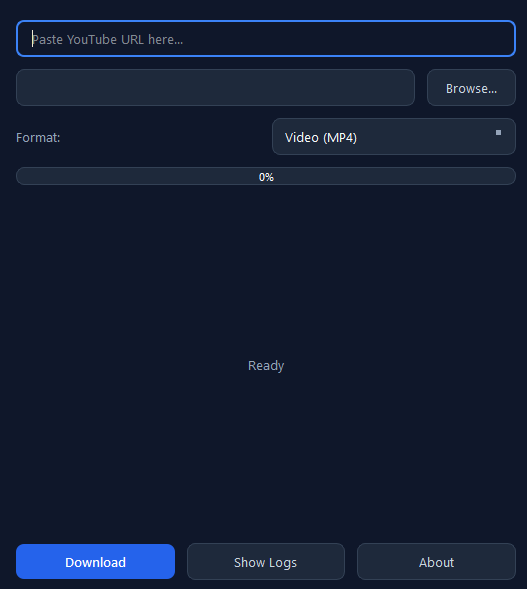
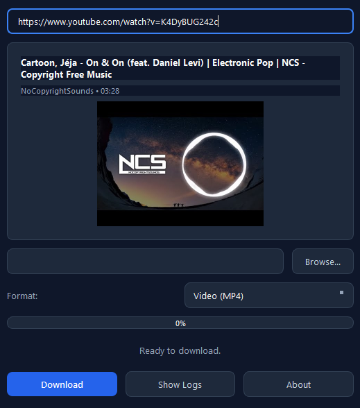

# FetchYT
> A simple yet effective YouTube downloader as mp3 or mp4

---
FetchYT is a simple YouTube downloader I made as I was bored with all the AD cluttered alternatives on the internet :).

<p align="center">
  
  
</p>
## Download:

1. Navigate to the **[Latest Release](../../releases/latest)** page.
2. Download `FetchYT-windows-x64.zip`.
3. Extract the archive and double-click `FetchYT.exe` to run.

---
## Build & Run from Source
If you rather want to compile and build from the source code:


1. Clone and Set Up Environment
```bash
git clone [https://github.com/your-username/FetchYT.git](https://github.com/your-username/FetchYT.git)
cd FetchYT
```
```
python -m venv venv
```
```
venv\Scripts\activate
```
2. Install Dependencies
```
pip install .
```
3. Test the App
```
python main.py
```
4. Build Executable Locally
```
pip install pyinstaller
```
```
pyinstaller --noconfirm --onedir --windowed `
  --icon "assets/icon.ico" `
  --add-data "core/bin/node.exe;core/bin" `
  --add-data "assets/icon.ico;assets" `
  --add-data "THIRD_PARTY_LICENSES.txt;." `
  --add-data "LICENSE-LGPLv2.1.txt;." `
  --add-data "LICENSE-LGPLv3.txt;." `
  --name "FetchYT" `
  main.py
```
---
### This project relies on several open-source libraries and binaries:

* yt-dlp – Released into the public domain under The Unlicense.

* imageio-ffmpeg – Licensed under the BSD 2-Clause License.

* FFmpeg – Licensed under the GNU LGPL v2.1+ / GPL. Source code available via FFmpeg Downloads and imageio-ffmpeg-binaries.

* Node.js – Licensed under the MIT License.

* PySide6 / Qt – Licensed under the GNU LGPL v3.

 Full licensing texts and notices are included in THIRD_PARTY_LICENSES.txt.